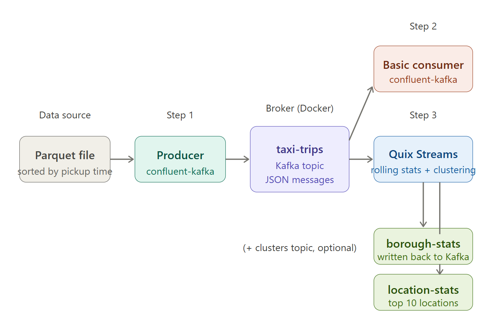
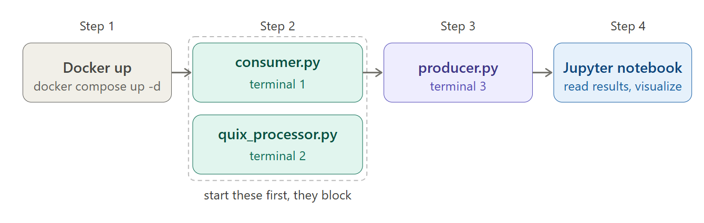

0. Created Stream subset parquet (~273k rows) = first 2 days of september 2019
1. Kafka Docker setup locally -> change replication to 1; change cluster ID to your generated random one
2. Create kafka-env venv with required packages
3. Simple test of the producer and consumer to check if everything works (run consumer_test.py first and run producer_test.py in a separate terminal, check consumer output)

Actual steps for the assignment:
1. Producer (confluent-kafka) -> broker/Docker (taxi trips - Kafka topic JSON messages)
2. Basic consumer (confluent-kafka)
3. Quix Streams (rolling stats + clustering)
4. borough stats and locations stats sent back to kafka

producer.py -> yellow-taxi-events -> quix_streams.py -> taxi-borough-stats taxi-location-stats

- Use the notebook cell to reset topics if we started to run the producer but stopped and we want to restart again

How to run: 
0. Docker has to be running
1. Terminal 1 - Quix Streams (consumes taxi events, computes rolling statistics, writes results back to Kafka)
2. Terminal 2 - (Optional?) Basic Consumer (for debugging, demonstrating raw event flow)
3. Terminal 3 - Producer (starts the live event stream)

